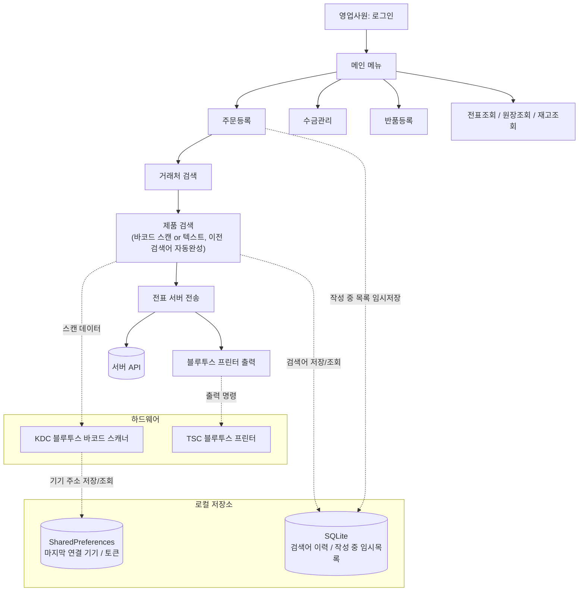
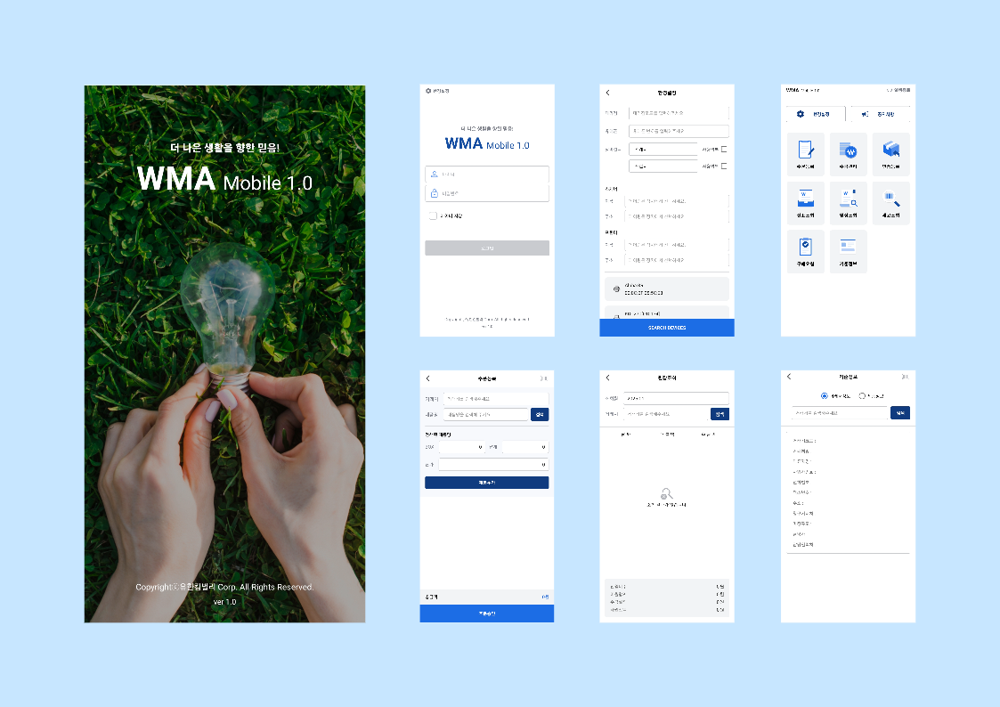

# WMA Mobile — 유한킴벌리 대리점 영업 업무 앱

> 유한킴벌리 대리점 영업사원이 현장에서 주문 · 수금 · 반품 업무를 처리하는 Android 앱입니다.

---

## 프로젝트 개요

유한킴벌리 대리점 영업사원은 매장을 방문해 **주문 등록, 수금, 반품, 재고 확인** 같은 업무를 그 자리에서 처리해야 합니다.

기존에는 종이 전표나 별도 단말기에 의존해 현장에서 즉시 처리하기 어려웠습니다.

이 앱은 블루투스 바코드 스캐너 · 블루투스 프린터를 연동해 **현장에서 스캔 → 전표 작성 → 출력**까지 한 번에 끝낼 수 있도록 만들었습니다.

현장 업무의 마찰(Friction)을 줄여, 영업사원이 주문 자체에 집중할 수 있도록 하는 것을 목표로 했습니다.

---

## 시스템 다이어그램

---

## 핵심 사용자 시나리오

**시나리오: 영업사원이 매장에서 주문을 등록하는 경우**

1. 앱을 켜면 마지막으로 연결했던 블루투스 스캐너에 **자동으로 재연결**된다.
2. 로그인 후 메인 메뉴에서 [주문등록]을 선택한다.
3. 거래처를 검색해 선택한다.
4. 제품을 바코드로 스캔하거나, 검색창에 입력하면 **이전에 주문했던 제품 목록이 자동완성**으로 뜬다.
5. 여러 제품을 담는 도중 전화가 와서 앱이 백그라운드로 내려가도, 작성 중이던 목록이 **자동으로 저장**되어 다시 들어오면 그대로 남아있다.
6. 수량 입력 후 전표를 서버로 전송한다.
7. 전송이 끝나면 같은 자리에서 **블루투스 프린터로 거래명세서를 바로 출력**한다.

---

## 해결하려는 문제

| 문제 상황 | 실제 영향 |
|---|---|
| 매장 현장에서 PC 없이 전표를 발행·출력할 방법이 없음 | 사무실 복귀 후 처리해야 해서 업무가 지연됨 |
| 매장 지하·외곽 등 통신이 불안정한 환경이 많음 | 작성 중이던 주문/반품/구매 목록이 앱 재시작 시 통째로 사라질 위험 |
| 블루투스 스캐너·프린터를 매번 다시 연결해야 함 | 영업사원이 매 방문마다 기기 페어링을 반복해야 하는 불편 |
| 동일 거래처에 반복 주문되는 제품이 많음 | 매번 제품명을 처음부터 검색해야 하는 비효율 |
| 반복 입력 중심의 현장 업무 흐름과 UI 조작 방식이 맞지 않음 | 검색·입력에 불필요한 터치 동작이 누적됨 |

---

## 내가 담당한 역할

이 프로젝트는 **기획부터 설계, 개발, 리팩터링까지 1인이 처음부터 담당**했습니다.

**직접 개발한 기능**
- 주문등록 / 수금관리 / 반품등록 / 전표조회·수정 / 원장조회 / 재고조회 / 구매요청·승인 전체 화면
- KDC 블루투스 바코드 스캐너 연동 (자동 재연결 포함)
- TSC 블루투스 프린터 연동 (메뉴별 출력 / 통합 출력)
- SQLite 기반 검색어 자동완성, 작성 중 목록 임시저장/복구
- Android 클라이언트 관점에서 JWT 기반 인증 흐름 및 401 대응 구현
- Android 앱 보안 정책(루팅 탐지, 앱 위변조 검증) 적용

**의사결정한 내용**
- 초기에는 Activity 중심으로 빠르게 기능을 구현했고, 화면이 늘어나며 유지보수가 어려워지자 **MVVM + Repository 구조로 전체 리팩터링**하기로 결정
- 로컬 저장이 필요한 데이터 중 단순 키-값(토큰, 마지막 연결 기기)은 SharedPreferences, 목록형 데이터(검색 이력, 임시 작성 목록)는 SQLite로 분리
- 블루투스 SDK(KDC)를 Activity마다 직접 구현하던 방식에서 `ScannerManager` 싱글톤으로 캡슐화하는 구조로 변경

**협업한 범위**
- 서버 API 명세는 별도 백엔드 담당자와 협의하여 진행했으며, 앱 내 구현은 전적으로 본인이 담당

> 담당하지 않은 영역(서버/백엔드, 디자인 리소스 제작)은 본 문서에서 다루지 않습니다.

---

## 문제 해결 사례

대표 사례 4가지만 정리했습니다. 나머지는 [Additional Improvements](#additional-improvements)에 짧게 정리했습니다.

### 사례 1. Activity 중심 구조 → MVVM 리팩터링

**Problem**
초기에는 빠른 개발을 위해 Activity 안에서 Retrofit 호출, JSON 빌드, 블루투스 SDK 처리를 모두 직접 구현했다. 화면이 늘어날수록 기능 추가와 수정이 하나의 Activity에 집중되며, 변경 영향 범위를 예측하기 어려워졌다. Activity 하나가 400~600줄까지 커졌고, 화면 회전 시 작성 중인 데이터가 사라지거나 테스트가 거의 불가능한 구조가 되었다.

**Approach**

| 대안 | 검토 결과 |
|---|---|
| 기존 구조 유지 | 화면이 늘어날수록 유지보수 비용이 계속 누적됨 |
| 일부 화면만 개선 | 구조가 화면마다 달라져 일관성이 깨지고, 신규 화면 추가 시 어떤 패턴을 따라야 할지 혼란이 생김 |
| MVVM 전환 | 전체 화면의 책임을 일관되게 분리 — **채택** |

신규 기능 추가 시 영향 범위를 줄이고 화면별 책임을 분리하기 위해 MVVM 패턴을 선택했다. 한 번에 전체를 바꾸면 회귀 버그를 찾기 어렵다고 판단해, 기존 동작을 유지하면서 화면 단위로 점진적으로 전환했다.

**해결**
- API 호출은 `Repository`로, 상태 관리는 `ViewModel`(Sealed Class + LiveData)로, UI는 `Activity`로 역할을 분리
- 6개 화면에 중복 구현되어 있던 블루투스 스캐너 코드를 `ScannerManager` 싱글톤으로 통일
- 전환 과정에서 발견한 버그(`GlobalScope` 오용으로 인한 메모리 누수 위험, `customerCd?.isNotEmpty()!!` 같은 `?.`·`!!` 혼용으로 인한 NPE 위험, Activity를 `new`로 직접 생성해 실제 화면 상태를 바꾸지 못하던 코드 등) 6건을 함께 수정

**Outcome**

| 구분 | 내용 |
|---|---|
| 기술적 성과 | ViewModel 2개(그중 1개는 사용처 없는 데드코드) → 20개, Repository 1개 → 10개로 확대. 139개 파일에서 +5,747 / −5,638라인 변경 |
| 엔지니어링 효과 | 화면별 책임 분리로 화면 회전 시 데이터 유지, Repository 단위 테스트 가능 구조 확보, 신규 화면 추가 시 구조가 예측 가능해져 개발 방식의 일관성을 확보 |
| 비즈니스 효과 | 신규 기능 추가 및 운영 대응 시 변경 영향 범위를 줄여, 이후 기능 확장에 드는 부담을 낮춤 |

---

### 사례 2. 주문 데이터 임시 저장 및 복구

**Problem**
주문 및 반품 업무는 입력해야 하는 품목과 정보가 많아 작성 시간이 길어질 수 있었다. 이 과정에서 앱이 예기치 않게 종료되거나 사용자가 다른 작업으로 이탈하면 작성 중인 데이터가 모두 유실될 위험이 있었다. 네트워크가 불안정한 환경이나 오프라인 상황도 고려해야 했다.

**Approach**

| 대안 | 검토 결과 |
|---|---|
| 서버에 임시 저장 | 네트워크 연결을 전제로 하므로, 오프라인 상황을 방어하지 못함 |
| 로컬(SQLite)에 임시 저장 | 네트워크 없이도 동작 — **채택** |

오프라인 환경에서도 동작해야 했기 때문에 로컬 저장 방식을 채택했다. 단순 키-값 저장(SharedPreferences)으로는 품목 목록 같은 구조화된 데이터를 다루기 어려워 SQLite를 사용했다.

**해결**
화면이 백그라운드로 전환되는 시점(`onStop`)에 작성 중인 품목 목록을 SQLite에 자동으로 저장하도록 구현했다. 사용자가 직접 화면을 나갈 때는 작성 중인 항목이 남아있으면 "전표를 저장하시겠습니까?" 팝업을 띄워 저장 또는 삭제를 선택하게 하고, 화면에 재진입하면 저장된 목록을 그대로 불러와 이어서 작업할 수 있도록 했다.

**Outcome**

| 구분 | 내용 |
|---|---|
| 기술적 성과 | `db/DBHelper.kt` 기반으로 화면별 임시 목록을 저장·복구하는 공통 패턴 구현, `onStop` 시점의 자동 저장 로직 추가 |
| 엔지니어링 효과 | 화면 전환·백그라운드 전환으로 인한 데이터 손실 위험을 구조적으로 제거 |
| 비즈니스 효과 | 오프라인 환경에서도 업무 연속성을 확보하고, 작성 내용을 다시 입력해야 하는 불편을 제거 |

---

### 사례 3. 블루투스 장비 자동 재연결

**Problem**
현장 업무에서는 바코드 스캐너와 프린터를 함께 사용해야 했다. 앱을 실행할 때마다 장비를 다시 검색하고 연결해야 한다면 업무 시작 전 반복적인 설정 과정이 필요하고, 사용자는 동일한 작업을 계속 수행해야 하는 불편함이 있었다.

**Approach**
마지막으로 연결한 블루투스 장비 정보를 SharedPreferences에 저장하고, 앱 실행 시 해당 정보를 기반으로 자동 재연결되도록 구현했다. 자동 재연결 대상은 바코드 스캐너와 블루투스 프린터다.

**Outcome**

| 구분 | 내용 |
|---|---|
| 기술적 성과 | 마지막 연결 기기 주소를 SharedPreferences에 저장하고, 앱 시작 시 `ScannerManager.connect(address)`를 자동 호출하는 구조 구현 |
| 엔지니어링 효과 | 기기 연결 로직을 `ScannerManager` 싱글톤에 캡슐화해 모든 화면에서 동일하게 재사용 |
| 비즈니스 효과 | 영업사원이 매장 방문마다 반복하던 수동 페어링 과정을 제거하고, 앱 실행 후 바로 업무를 시작할 수 있게 함 |

---

### 사례 4. 토큰 만료(401) 전역 처리

**Problem**
로그인 후 발급된 토큰이 만료되면 서버가 401을 응답했지만, 기존에는 이를 별도로 처리하지 않아 사용자가 원인을 알 수 없는 에러 상태에 계속 머무르게 되는 문제가 있었다.

**Approach**
API 호출을 가로채는 `AuthInterceptor`에서 401 응답을 감지하면 토큰을 즉시 삭제하고, `LiveData` 이벤트로 앱 전역에 알리도록 구현했다. 이 이벤트는 `GlobalApplication`에서 한 번만 관찰해 로그인 화면으로 이동시키며, 동시에 여러 API에서 401이 발생해도 중복으로 화면 이동이 일어나지 않도록 플래그로 막았다.

**Outcome**

| 구분 | 내용 |
|---|---|
| 기술적 성과 | Interceptor에서 감지한 401 이벤트를 앱 전역으로 전달해 로그인 상태를 일관되게 관리하는 구조 구현 |
| 엔지니어링 효과 | `isNavigatingToLogin` 플래그로 동시 다발적 401 응답에 의한 중복 화면 이동(Race Condition) 방지 |
| 비즈니스 효과 | 토큰 만료 시 사용자가 원인을 알 수 없는 에러 화면에 머무르지 않고, 자동으로 로그인 화면으로 안내받도록 개선 |

---

## Additional Improvements

대표 사례 외에 현장 사용성을 위해 추가한 개선들입니다.

| 개선 | 내용 |
|---|---|
| **검색 이력 기반 상품 자동완성** | 동일 상품을 반복 검색해야 하는 비효율을 줄이기 위해, SQLite에 검색 이력을 저장하고 검색창 입력 시 자동완성 목록을 제공 |
| **키보드 중심 입력 흐름 개선** | 입력창마다 터치로 이동해야 하는 불편을 줄이기 위해, IME Action으로 엔터 입력 시 다음 입력창으로 자동 이동하고 마지막 입력에서 자동으로 검색 실행 |
| **루팅·위변조 탐지를 통한 보안 대응** | 영업·거래처 데이터를 다루는 앱 특성상, RootBeer로 루팅 여부를 탐지하고 서명 해시로 위변조 여부를 검증해 위험 감지 시 앱을 종료 |

---

## 프로젝트 화면

> 왼쪽부터: 스플래시 / 로그인 / 기준정보 / 메인 메뉴 / 수금등록 / 인쇄옵션 / 기준정보 상세

| 화면 | 목적 | 구현 포인트 |
|---|---|---|
| 스플래시 | 앱 시작 시 보안 체크(루팅 탐지, 위변조 검증) | 보안 체크 결과를 `lazy`로 1회만 계산해 화면 회전 시 재검증 방지 |
| 로그인 | 사번/비밀번호로 로그인 및 토큰 발급 | 서버 응답 `data`가 null인 경우를 검증해 NPE 방지 |
| 메인 메뉴 | 업무 메뉴 진입 허브 | 사원 권한(`authorityBuy`)에 따라 구매요청 메뉴 노출 여부 동적 결정 |
| 수금등록 | 거래처 채권 조회 후 수금 전표 등록 | 현금/어음/현금+어음 결제 분기에 따른 JSON 빌드 로직을 ViewModel로 분리 |
| 인쇄 옵션 | 작성한 전표를 블루투스 프린터로 출력 | 메뉴별 출력 / 통합 출력 분기 처리 |
| 기준정보 | 거래처·제품 정보 상세 조회 | 목록 조회와 상세 조회 상태를 별도 LiveData로 분리해 관리 |

---

## 기술 스택

| 분류 | 기술 | 사용 목적 |
|---|---|---|
| Language | Kotlin | Android 앱 개발 언어 |
| Architecture | AndroidX ViewModel / LiveData | 화면 상태 관리 및 화면 회전 대응 |
| Architecture | Kotlin Coroutines | 비동기 처리 (`GlobalScope` 오남용을 `lifecycleScope`로 교체) |
| Networking | Retrofit2 / OkHttp3 | 서버 REST API 통신, `AuthInterceptor`로 토큰 자동 첨부 |
| Networking | Gson | API 응답 직렬화/역직렬화 |
| Persistence | SQLite (`DBHelper`) | 검색어 이력, 작성 중 목록 임시저장/복구 |
| Persistence | SharedPreferences | 로그인 토큰, 마지막 연결 블루투스 기기 주소 등 단순 값 저장 |
| Hardware | KDC SDK (`kdcreader-release.aar`) | 블루투스 바코드 스캐너 연동 |
| Hardware | TSC 프린터 라이브러리 (`bluetooth.jar`) | 블루투스 영수증/전표 프린터 연동 |
| Security | RootBeer | 루팅 탐지를 통한 보안 강화 |
| UI | Glide / Lottie | 이미지 로딩 및 로딩 애니메이션 |
| Build | R8 / ProGuard | 릴리즈 빌드 코드 난독화 및 리소스 축소 |

---

## 회고

**가장 어려웠던 점**
블루투스 스캐너·프린터처럼 Activity 생명주기와 강하게 묶인 하드웨어 I/O를 MVVM 구조로 옮기는 과정이 까다로웠습니다. ViewModel은 생명주기를 직접 알지 못하기 때문에, 어떤 로직을 ViewModel로 옮기고 어떤 로직(예: 포트 연결/해제처럼 `onPause`/`onDestroy`에 묶여야 하는 코드)을 Activity에 남겨야 하는지 화면마다 판단해야 했습니다.

**아쉬웠던 점**
초기 설계 단계에서부터 Repository 패턴을 적용했더라면, 이후 전체 리팩터링에 들어간 시간을 줄일 수 있었을 것입니다. 빠른 개발을 위해 Activity 중심으로 시작한 것이 결과적으로 더 큰 리팩터링 비용으로 돌아왔습니다.

**다시 개발한다면 개선하고 싶은 점**
- 화면 수가 늘어날 것이 예상되는 시점부터는 처음부터 MVVM + Repository 구조로 설계
- 검색어 이력, 임시 저장 목록처럼 여러 화면에서 반복되는 SQLite 접근 로직을 공통 DAO/Repository로 더 일찍 추상화

**이번 경험을 통해 얻은 교훈**
빠른 개발 속도와 구조적 안정성은 트레이드오프 관계에 있다는 것을 체감했습니다. 초기에는 개발 속도를 우선했지만, 기능이 늘어날수록 구조적 안정성의 중요성을 깨달았고, 이후에는 작은 화면부터 역할 분리를 고려하는 습관을 갖게 되었습니다.
